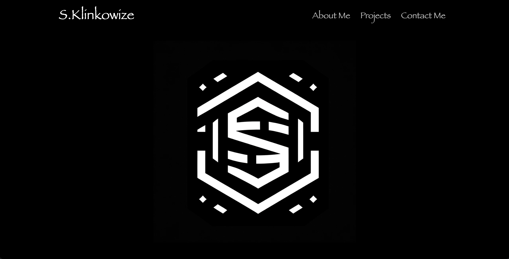

# Full Stack Developer Portfolio

Welcome to my Full Stack Developer Portfolio! This project showcases my skills and projects as a full-stack developer, including front-end design and back-end functionality. It's designed to be responsive, ensuring a seamless experience across all devices.

# Screenshot of Webpage

## Features

Responsive Design: The portfolio is fully responsive, adapting to various screen sizes and devices.  
Dynamic Content: Features sections for "About Me", "Projects", and "Contact Me", each designed with user engagement in mind.  
CSS Animations: Utilizes subtle CSS animations for a more dynamic user experience, including fade-in effects on page load.  

# Link to Website